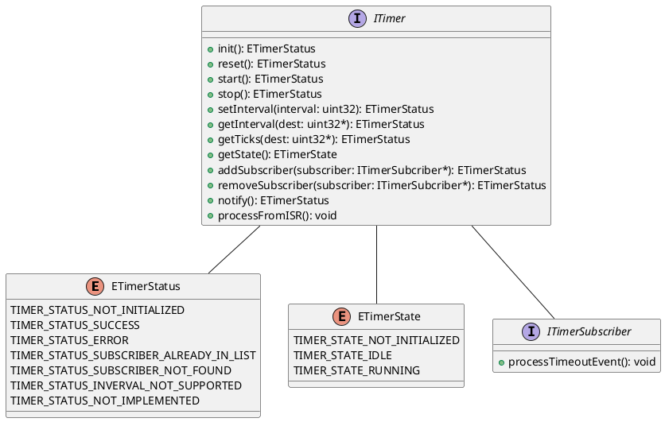
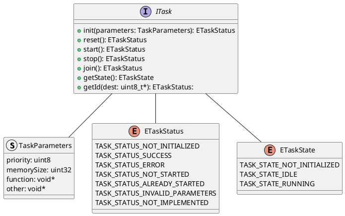
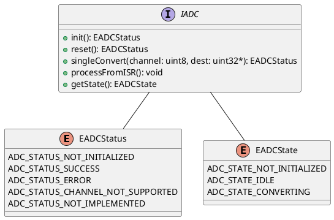

# Software Architecture

## Revisions

| Revision | Note | Date | Author |
| - | - | - | - |
| v0.1 | Initial version | 03/08/2025 | dieisabel |
| v0.2 | Add Task and ADC APIs, extend Timers API | 03/12/2025 | dieisabel |

## Content

- [1. Introduction](#1-introduction)
- [2. HAL](#2-hal)
    - [2.1 Timers](#21-timers)
- [3. OS](#3-os)
- [4. Oscilloscope](#4-oscilloscope)
    - [4.1 ADC](#41-adc)

## 1. Introduction

This document contains software architecture. Text is written in English, Markdown format with PlantUML diagrams.

## 2. HAL

Hardware is abstracted from software through HAL (Hardware Abstraction Layer), which gives engineers ability to port software to many hardware platforms.

### 2.1 Timers

Main purpose of timers is to provide time counters or/and provide functionality for periodicity.

API for timers is presented on [Diagram 1](#diagram-1-timer-api).

##### Diagram 1: timer API

## 3. OS

Software is abstracted from OS through OS abstraction layer.

### 3.1 Task

## 4. Oscilloscope

### 4.1 ADC

ADC API is presented on [Diagram 3](#diagram-3-adc-api).

##### Diagram 3: ADC API

