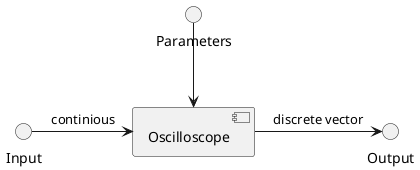

# Documentation Guidelines

## Revisions

| Revision | Note | Date | Author |
| - | - | - | - |
| v0.1 | Initial version | 12/28/2024 | dieisabel |
| v0.2 | Add rule for tables and diagrams | 03/01/2025 | dieisabel |

## Content

- [1. Introduction](#1-introduction)
- [2. Rules](#2-rules)
- [3. Resources](#3-resources)
    - [3.1 Resource 1](#31-resource-1)
    - [3.2 Resource 2](#32-resource-2)

## 1. Introduction

This document contains guidelines for writing documentation for Scilla project.
Text is written in English, Markdown format.

## 2. Rules

1. All documents must be written in English
1. All documents must be version controlled with separate chapter for
revisions table. Example is located in [3.1 Resource 1](#31-resource-1)
1. All dates must be in format `<month>/<day>/<year>`
1. All tables and diagrams must have a level 5 heading that must contain a short description of table and diagram content. Examples are located in [3.2 Resource 2](#32-resource-2)

## 3. Resources

### 3.1 Resource 1

Revisions table example is below:

| Revision | Note | Date | Author |
| - | - | - | - |
| v0.1 | Initial version | 12/29/2025 | KAE |
| v0.2 | Add new chapter "Something" | 12/30/2025 | KAE |

### 3.2 Resource 2

##### Table 1: ADC block specification

| Problem space requirement (Oscilloscope) | Solution space requirement (ADC) |
| - | - |
| Input channels: at least 2 analog channels | Input channels: at least 2 analog input channels |
| Analog bandwidth: up to 1MHz | Sampling rate: 8MHz |
| Input impedance: 1MOhms | Input impedance: 1MOhms |

##### Diagram 1: oscilloscope system block

