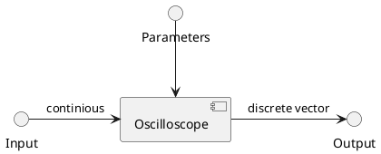
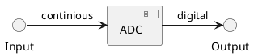
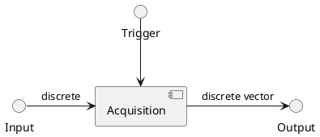
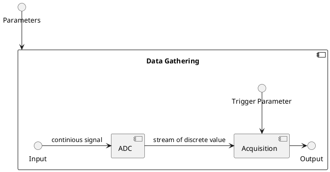
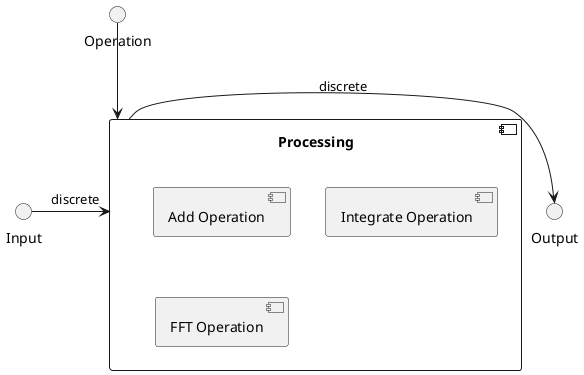

# Technical Specifications

## Revisions

| Revision | Note | Date | Author |
| - | - | - | - |
| v0.1 | Initial version | 02/15/2025 | dieisabel |

## Content

- [1. Introduction](#1-introduction)
- [2. Terminology](#2-terminology)
- [3. Oscilloscope](#3-oscilloscope)
   - [3.1 Data gathering](#31-data-gathering)
      - [3.1.1 ADC](#311-adc)
      - [3.1.2 Acquisition](#312-acquisition)
      - [3.1.3 System Block](#313-system-block)
   - [3.2 Processing](#32-processing)
- [4. Resources](#4-resources)

## 1. Introduction

This document contains technical specifications. Text is written in English, Markdown format.

## 2. Terminology

ADC (Analog-Digital-Converter) - device that samples continious signals

## 3. Oscilloscope

In the real world oscilloscope main tasks are:
1. show a plot of a signal
1. analyze certain properties of a signal
1. apply certain operations to signal and show result

Oscilloscope system block is presented in [Diagram 1](#diagram-1-oscilloscope-system-block).

##### Diagram 1: oscilloscope system block

As you can see it is a block that accepts:
- `Input` - **continious** wave, more in Data Gathering chapter
- `Parameters` - some parameters that control behaviour
- `Output` - **discrete vector** output

As per technical task there will be a control panel that will show signal, so
we scope oscilloscope tasks only to data gathering and data processing.

Every task will be explained below in separate chapters and in the end of
this chapter there will be presented a oscilloscope system block.

### 3.1 Data gathering

#### 3.1.1 ADC

The signal is modeled as a function $ V(t) $, where $ V $ - voltage, $ t $ - time.
They are modeled as **continious** signal. To process it we need to
convert data to **digital** domain. To do it we need a blocks which are  called **sampler** and
**quantizier**. They are implemented using **ADC**. Requirements to ADC are listed below:
1. **Input channels:** at least 2 analog input channels
1. **Sampling rate:** to show a signal with frequency of 1MHz we need to sample
   at least 8 samples, so sampling rate must be at least 1MHz * 8 = 8MHz
1. **Input impedance:** input channels must have an 1MOhms input impedance

Specification is presented on [Table 1](#table-1-adc-block-specification).

##### Table 1: ADC block specification

| Problem space requirement (Oscilloscope) | Solution space requirement (ADC) |
| - | - |
| Input channels: at least 2 analog channels | Input channels: at least 2 analog input channels |
| Analog bandwidth: up to 1MHz | Sampling rate: 8MHz |
| Input impedance: 1MOhms | Input impedance: 1MOhms |

Block diagram is presented on [Diagram 2](#diagram-2-adc-system-block).

##### Diagram 2: ADC system block

#### 3.1.2 Acquisition

ADC samples signal continiously. To synchronize data acquisition with trigger we need
separate acquisition block that will start storing data after trigger signal.
Acqusition block stores a vector of data with some size $ N $ and gives it to
other block. System diagram is presented in [Diagram 3](#diagram-3-acquisition-system-block).

##### Diagram 3: acquisition system block

Specification is presented on [Table 2](#table-2-acquisition-specification).

##### Table 2: acquisition specification

| Problem space requirement (Oscilloscope) | Solution space requirement (Acquisition) |
| - | - |
| Modes: edge trigger, normal, one-time | Trigger modes: edge trigger, normal, one-time |

#### 3.1.3 System Block

Data gathering system block is presented on [Diagram 4](#diagram-4-data-gathering-system-block).

#### Diagram 4: data gathering system block

### 3.2 Processing

After data gathering block can process data. Per technical task oscilloscope must have a support
for math functions: addition, substraction, integration, FFT. System block for processing is
presented on [Diagram 5](#diagram-5-oscilloscope-processing-subblock).

#### Diagram 5: oscilloscope processing subblock

## 4. Resources

resources/oscilloscope/Oscilloscope Basics Primer
